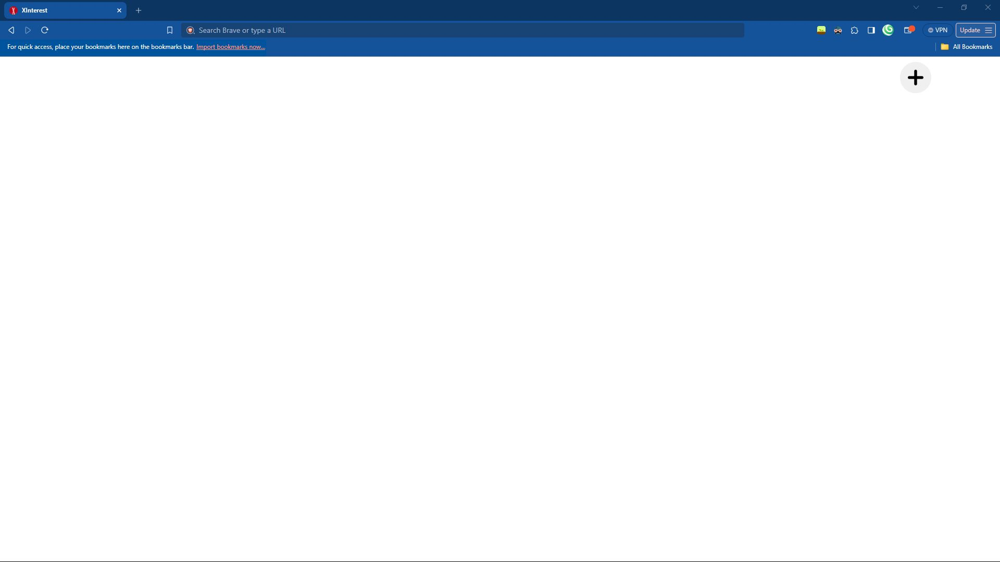
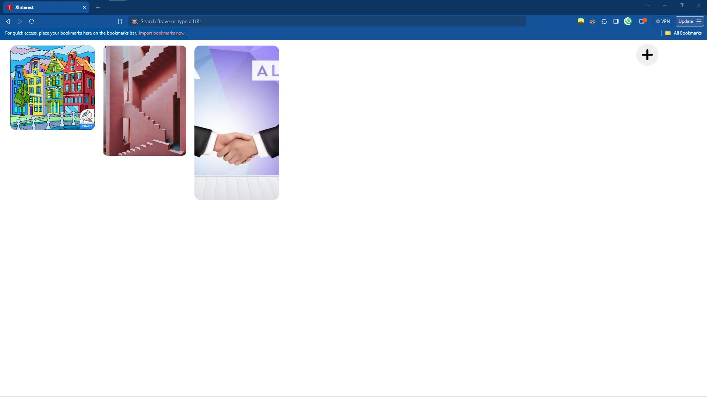
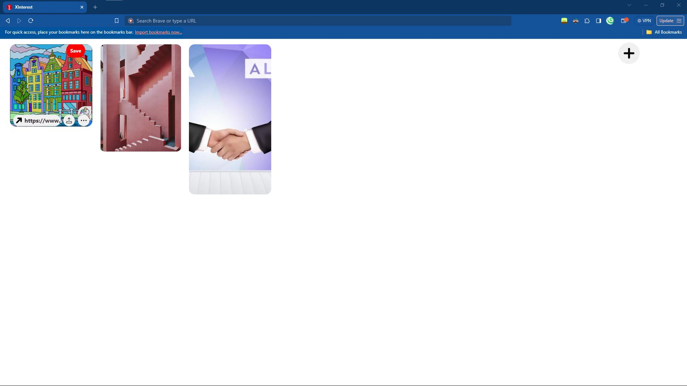

# XInterest

A clone of the Pinterest website. This is a backup for my hard-disk, just in-case they fail. and for you, This can be a place to start.

The assests can be found: [here](https://github.com/an-object-is-a/js-pinterest-clone)

**(Thanks An Object is A!)**

## Acknowledgements

 - Tutorial by: [An Object is A](https://www.youtube.com/@AnObj)

 - Huge shout-out to my youngest project as of writing this: [Xelegram](https://github.com/l-xdt/xelegram)

 - A huge help in this project: [DiffChecker](https://www.diffchecker.com)


## Authors

- [LeidenSchaft-Xiotim Development Team](https://www.github.com/l-xdt/)

- [Alvin Maranx, II ツ (Avun)](https://github.com/avunii/)

- [An Object is A](https://www.youtube.com/@AnObj)


## Demo

There is a demo on this project! And I'm not being indirect, here is the link: click [here](https://l-xdt.github.io/xinterest/)


## Features

- Create your own pins.

- Auto deletes on refresh.

- Change root colors.

- Use your own photos.

- Cross platform.

- **PS:** A little more features added, but you need to discover it on your own.


## Screenshots







**Written in plain HTML, CSS and JavaScript. The rest, you need to figure out.**

## Run Locally

Clone the project - and run it on XAMPP.

```bash
  git clone https://github.com/l-xdt/xinterest
```

Go to the project directory

```bash
  cd xinterest
```

Install XAMPP (via Chocalatey, if you don't have it).

```bash
  chocalatey install xampp
```

Start the server.

```bash
  npm run start
```

**PS:** If you trust your web skills, here is a manual on how to self-host a domain [here](https://www.youtube.com/watch?v=_eQGAJVtRCs) (by Soeng Souy)

## Roadmap

- Additional browser support.

- Change the title of Pins.

- Add your own pins.

- Change the meaning of your pins.

- Change your pin's location.

- Change the FavIcon, inspired (of-course) by our signature: **X**

- Change the code to be what you want.

- Written in **Vanilla HTML, CSS and JavaScript.**

## Support

For support, reach out to us via either of our emails: [this one](mailto:trowesigames@gmail.com) or [this one](mailto:leidenschaft.tech@hotmail.com) or join our Discord server: which is not up as of writing this.


## Feedback

This still applies to feedback aswell, Whether you want to give us positive words, or negative ones, send away. (but please only send constructive critisism).

Send away: [here](mailto:trowesigames@gmail.com) or [here](mailto:leidenschaft.tech@hotmail.com).


## FAQ

**Now, my fav, FAQ!**

#### Can I modify this to fit my needs?

Yeah! That is why we make these repositories for. For you! To tinker and to try new things.

#### Can I host this? If I can how?

You can! with my favourite Apache container, XAMPP! Since, I have explained it atleast 13 times, we can skip it.

If you want to go ahead with it, you can get started by hosting your websites, click [here](https://www.youtube.com/watch?v=LzucEZh4_no) to following the tutorial by MainlyWebStuff.

And, for a domain, click [here](https://www.youtube.com/watch?v=_eQGAJVtRCs) to follow the tutorial by Soeng Souy.


## Used By

This project is used by the following companies:

- LeidenSchaft-Xiotim Accquistions (Limited).

- XDT-Studium.

- Xiotim Development Team [Limited] (XDT).

- XDT-noHesi.


## Related

Here are some related projects:

- [XioTok](https://github.com/l-xdt/xiotok/)

- [noHesi](https://github.com/l-xdt/no-hesi/)

- [Xirox](https://github.com/l-xdt/xirox/)

- [Studium](https://github.com/l-xdt/studium/)

- [XioTim](https://github.com/l-xdt/xiotim/)

- [XioTube](https://github.com/l-xdt/xiotube/)

- [xSocial](https://github.com/l-xdt/xSocial/)

- [XGram](https://github.com/l-xdt/xgram/)

- [XChat](https://github.com/l-xdt/xchat/)

- [XCord](https://github.com/l-xdt/xcord/)

- [XApp](https://github.com/l-xdt/xapp/)

- [Xelegram](https://github.com/l-xdt/xelegram/)


## Documentation

- Although I cannot tell you all about this project (yet), you can go and check out the tutorial, linked below:

- [Pinterest Clone](https://www.youtube.com/watch?v=wfgGyQ_FDik) by An Object is A.


## API Reference

As earlier mentioned, there is no APIs and/or Frameworks, just Icons. This project is very base-level, if there is any. I will update this readMe.

